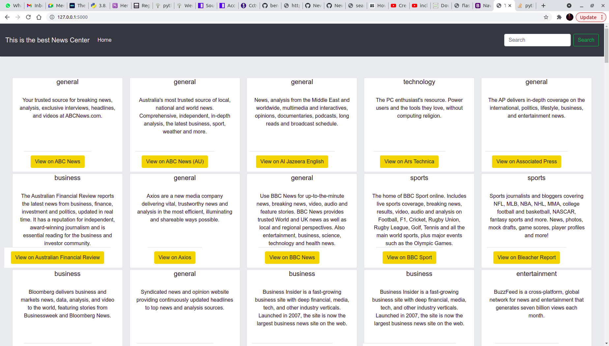

# NEWS APP
### Here is the landing page of News App, September 2021

#### By **Bensam mwaniki**
## Description
This is web application that allows you to view news, articles. You can also navigate to the relevant website of the news article.
## BEHAVIOUR DRIVEN DEVELOPMENT
| GENERAL BEHAVIOUR | INPUT | OUTPUT|
|:------------------|:--------|:-----------|
|the user is able to search for aticle intrested in| search for the aticles|user can see the his or her search|
|User wants to view current news| They select the news source they want or click on the higlights|should take you to a new tab with the clicked news update|
|User wants search a particular topic| They enter the topic on the search bar|All related stories are dispalyed|
|User wants to read a particular story| They select the story from the source page|They are redirected to the website|
|   |    |
## Setup/Installation Requirements
* clone the following repo https://github.com/bensammwaniki/News-site
* use your desired folder on your machine and clone
the repo there
* Install all required prerequisities.
* In your terminal run the following commands
* $ chmod a+x start.sh

## Known Bugs
The search might break but working to fix it 
If you experience any you can reach via email bensammwaniki@gmail.com
## Technologies Used
1.Python 

2.Flask

3.News api key
## Support and contact details
Incase of any queries you can reach me through email bensammwaniki@gmail.com

### License
This Project comes wit MIT License. 

MIT License

Copyright (c) 2021 By Bensam Mwaniki

Permission is hereby granted, free of charge, to any person obtaining a copy
of this software and associated documentation files (the "Software"), to deal
in the Software without restriction, including without limitation the rights
to use, copy, modify, merge, publish, distribute, sublicense, and/or sell
copies of the Software, and to permit persons to whom the Software is
furnished to do so, subject to the following conditions:

The above copyright notice and this permission notice shall be included in all
copies or substantial portions of the Software.

THE SOFTWARE IS PROVIDED "AS IS", WITHOUT WARRANTY OF ANY KIND, EXPRESS OR
IMPLIED, INCLUDING BUT NOT LIMITED TO THE WARRANTIES OF MERCHANTABILITY,
FITNESS FOR A PARTICULAR PURPOSE AND NONINFRINGEMENT. IN NO EVENT SHALL THE
AUTHORS OR COPYRIGHT HOLDERS BE LIABLE FOR ANY CLAIM, DAMAGES OR OTHER
LIABILITY, WHETHER IN AN ACTION OF CONTRACT, TORT OR OTHERWISE, ARISING FROM,
OUT OF OR IN CONNECTION WITH THE SOFTWARE OR THE USE OR OTHER DEALINGS IN THE
SOFTWARE.